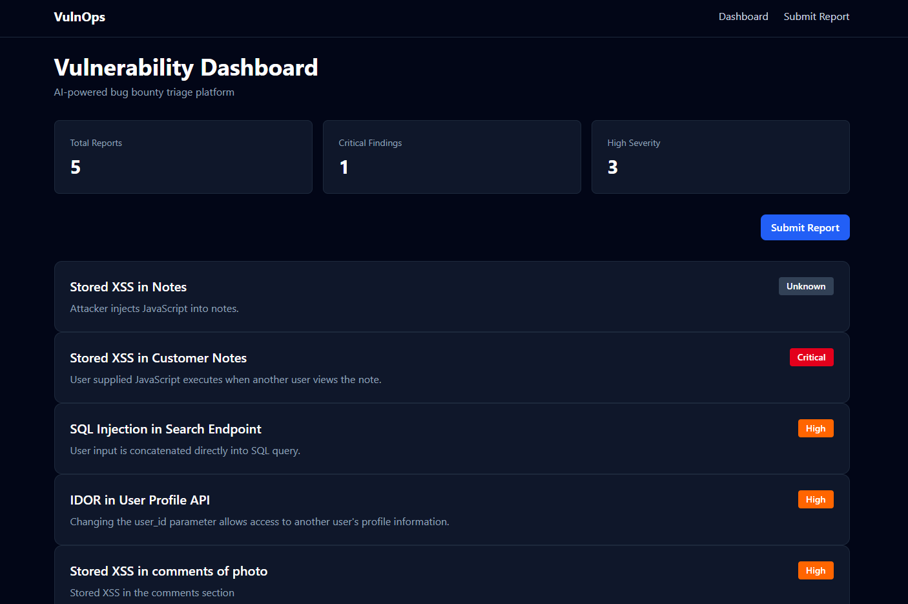
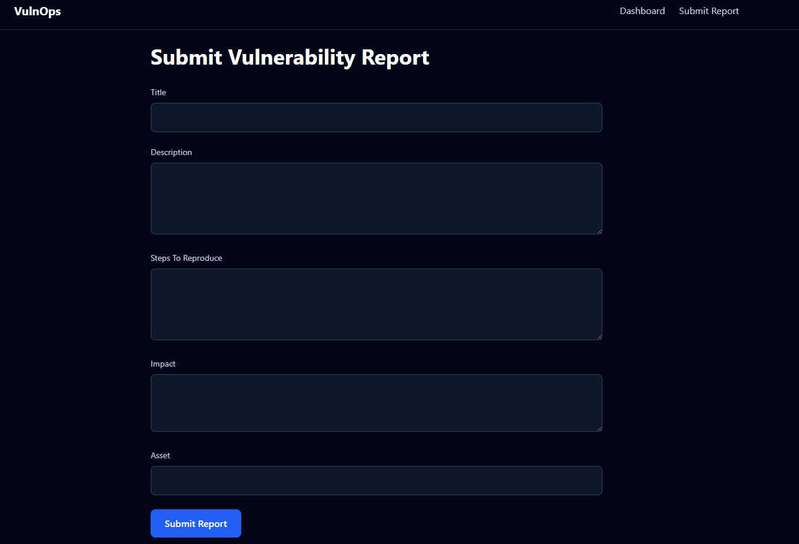
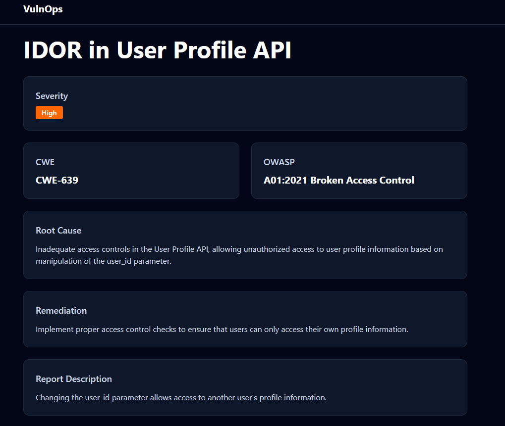
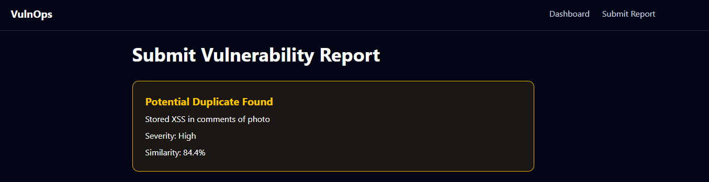
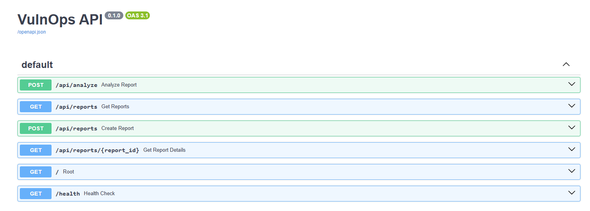

# VulnOps

## AI-Powered Vulnerability Triage Platform

VulnOps is a full-stack security platform that automates vulnerability triage workflows using AI. The platform accepts vulnerability reports, classifies security findings, maps them to CWE and OWASP categories, generates remediation guidance, and detects duplicate submissions using vector embeddings.

The goal of VulnOps is to simulate the workflow used by modern bug bounty and vulnerability management teams, reducing manual effort required to triage and prioritize security reports.

---

## Features

### AI Vulnerability Analysis

Automatically analyzes submitted vulnerability reports and generates:

- Vulnerability Type Classification
- Severity Assessment
- Root Cause Analysis
- Remediation Recommendations

### Security Intelligence Mapping

Maps vulnerabilities to industry-standard frameworks:

- CWE (Common Weakness Enumeration)
- OWASP Top 10


### Duplicate Detection

Uses OpenAI embeddings and ChromaDB vector search to identify semantically similar vulnerability reports.

Example:

**Report Submitted**

> Stored Cross Site Scripting in Comment Section

**Potential Duplicate Found**

> Stored XSS in comments of photo

This helps reduce duplicate submissions and improve triage efficiency.

### Analyst Dashboard

Provides a centralized dashboard for:

- Viewing vulnerability reports
- Reviewing AI-generated analysis
- Viewing severity classifications
- Accessing CWE and OWASP mappings
- Reviewing remediation recommendations

---

## Screenshots

### Dashboard



### Submit Report



### Vulnerability Details



### Duplicate Detection



### API Documentation



---

## Architecture

```text
Researcher
    │
    ▼
Submit Vulnerability Report
    │
    ▼
FastAPI Backend
    │
    ├── OpenAI Analysis
    │      ├── Vulnerability Classification
    │      ├── Severity Assessment
    │      ├── CWE Mapping
    │      ├── OWASP Mapping
    │      ├── Root Cause Analysis
    │      └── Remediation Guidance
    │
    ├── OpenAI Embeddings
    │      └── ChromaDB Vector Search
    │              └── Duplicate Detection
    │
    ▼
PostgreSQL
    │
    ▼
React Analyst Dashboard
```

---

## Tech Stack

### Frontend

- React
- TypeScript
- Vite
- Tailwind CSS
- Axios
- React Router

### Backend

- FastAPI
- SQLAlchemy
- PostgreSQL
- Pydantic

### AI & Security Intelligence

- OpenAI GPT-4o-mini
- OpenAI Embeddings
- CWE Mapping
- OWASP Top 10 Mapping

### Vector Search

- ChromaDB
- Semantic Similarity Search
- Duplicate Detection Engine

---

## Project Structure

```text
VulnOps/

├── backend/
│   ├── app/
│   │   ├── models/
│   │   ├── routers/
│   │   ├── services/
│   │   ├── schemas/
│   │   └── database.py
│   │
│   ├── chroma_db/
│   └── requirements.txt
│
├── frontend/
│   ├── src/
│   │   ├── pages/
│   │   ├── components/
│   │   └── services/
│   │
│   └── package.json
│
└── README.md
```

---

## Database Schema

### Reports

```text
id
title
description
steps
impact
asset
created_at
```

### Analyses

```text
id
report_id
vulnerability_type
severity
cwe
owasp
root_cause
remediation
created_at
```

---

## API Endpoints

### Reports

```http
GET /api/reports
```

Retrieve all reports.

```http
GET /api/reports/{id}
```

Retrieve report details and analysis.

```http
POST /api/reports
```

Submit a new vulnerability report.

---

## Local Setup

### Backend

```bash
cd backend

python -m venv .venv

source .venv/bin/activate

pip install -r requirements.txt

uvicorn app.main:app --reload
```

Backend:

```text
http://localhost:8000
```

Swagger:

```text
http://localhost:8000/docs
```

### Frontend

```bash
cd frontend

npm install

npm run dev
```

Frontend:

```text
http://localhost:5173
```

---

## Key Security Capabilities

- AI-assisted vulnerability triage
- Vulnerability severity classification
- CWE enrichment
- OWASP enrichment
- Root cause identification
- Remediation generation
- Duplicate vulnerability detection
- Semantic similarity analysis
- Vulnerability management workflow automation

---

## Why I Built This

Modern security teams receive a large volume of vulnerability reports that require manual triage, prioritization, and duplicate detection. VulnOps explores how AI and vector search can automate significant portions of this workflow, helping security analysts focus on remediation and risk reduction rather than repetitive triage tasks.

---

## Future Improvements

- User authentication and role-based access control
- Analyst notes and collaboration
- Search and filtering capabilities
- Vulnerability lifecycle tracking
- Dashboard analytics and charts
- PDF report export
- Docker deployment
- GitHub Actions CI/CD
- Multi-tenant support
- Integration with bug bounty platforms

---

## Resume Highlights

- Built an AI-powered vulnerability triage platform using FastAPI, React, PostgreSQL, OpenAI, and ChromaDB.
- Implemented automated vulnerability classification, severity assessment, CWE/OWASP mapping, remediation generation, and semantic duplicate detection using vector embeddings.

---

## Author

Samartha Suresh